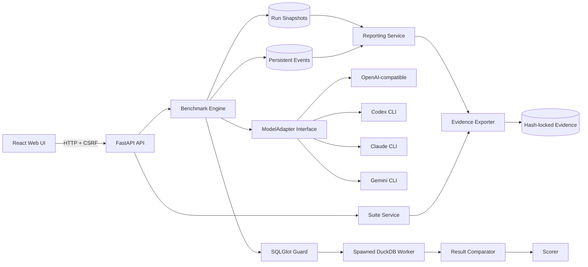
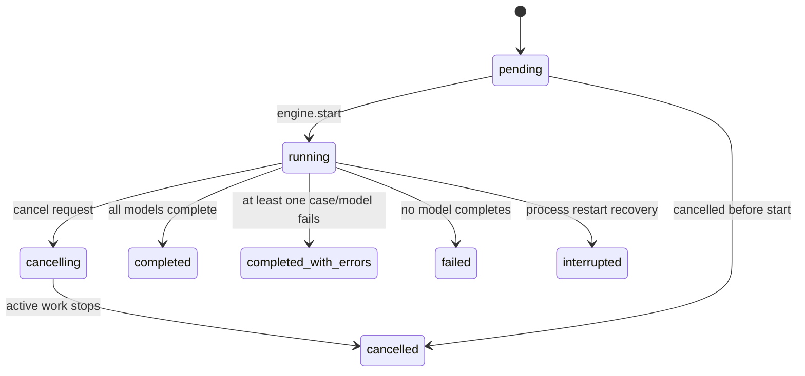

# 架构与信任边界

## 1. 设计目标

SQL 擂台不是通用 Agent 平台。它的中心不变量是：

> 给定发布题库哈希、运行快照和模型输出，评分过程应可重放、可解释、可定位到原始证据。

由此得到四个约束：

1. 题库发布后不可变。
2. 模型不接触参考 SQL、金标和评分规则。
3. 模型 SQL 在只读、限时、限资源的独立进程执行。
4. 报告只从持久化运行快照生成，不从可变的当前配置拼接。

## 2. 总体数据流

## 3. 模块边界

| 模块 | 职责 | 不应承担的职责 |
| --- | --- | --- |
| `backend/app/domain.py` | 严格领域合同：题库、语义层、AST 规则、模型输出 | 数据库查询、HTTP、Provider 细节 |
| `backend/app/models.py` | SQLAlchemy 持久化模型和不可变快照字段 | 评分和业务判断 |
| `backend/app/services/suites.py` | 内容哈希、DuckDB 构建、结构提取、金标生成、发布自检 | 模型调用 |
| `backend/app/services/benchmark_engine.py` | 运行状态机、取消、模型/案例编排、证据落库 | HTTP 序列化、具体 Provider 协议 |
| `backend/app/adapters/base.py` | `ModelAdapter`、请求/响应/错误/事件接口，CLI 进程治理 | SQL 评分 |
| `backend/app/adapters/*` | 单一 Provider/CLI 的健康检查、隔离、协议解析 | 题库和金标读取 |
| `backend/app/services/sql_evaluator.py` | SQL AST 守卫、隔离执行、AST 能力规则、评分 | 模型身份判断 |
| `backend/app/services/result_compare.py` | 类型归一化、列对齐、多重集匹配、差异摘要 | SQL 执行 |
| `backend/app/services/events.py` | 有序持久化事件、SSE Hub、delta 缓冲 | 运行状态推进 |
| `backend/app/services/reporting.py` | 从运行快照构建运行、案例和报告文档 | 读取当前模型配置 |
| `backend/app/services/evidence.py` | 全量导出、公开脱敏、文件清单与 SHA-256 验真 | 原始数据库公开 |
| `backend/app/api/routes.py` | HTTP 输入校验、事务边界、状态码和服务调用 | 重复实现报告/评分逻辑 |
| `frontend/src/api/client.ts` | HTTP/SSE 客户端与断线续传 | 重新计算后端分数 |
| `frontend/src/pages/*` | 用户流程页面 | 持久化业务状态 |

## 4. 深接口

### `ModelAdapter`

一个适配器只需实现：

- `check(profile) -> AdapterHealth`
- `generate(profile, request, emit, cancel) -> GenerationResponse`

运行引擎只依赖标准化结果：原始输出、解析输出、请求/解析模型身份、Token、Provider request ID、耗时和协议严格性。Provider 特有 JSONL/SSE、命令行参数、认证和错误映射全部留在适配器内部。

### `SuiteSource -> PublishedSuite`

发布接口把可编辑源一次性转换为：

- 内容哈希；
- 结构快照；
- 金标 JSON；
- DuckDB 仓库；
- 构建清单。

运行只读取发布产物，不重新解释草稿。

### `EvaluationOutcome`

评分链只交换一个包含以下字段的结果：

- 守卫/执行状态；
- 格式化 SQL；
- 实际结果和差异；
- 固定评分明细；
- 执行耗时；
- 稳定错误码和错误信息。

### 静态证据接口

`reporting.py` 是 API 和 `evidence.py` 的共同接口。这样在线报告与公开报告使用同一实现，避免“网页看到一套、GitHub 发布另一套”。

## 5. 运行状态机

模型和案例有各自的子状态。状态写库与事件写库是分开的短事务；事件 `seq` 通过数据库原子自增生成，保证同一运行内单调有序。

## 6. 信任边界

### 6.1 作者与模型不是同一信任域

题库作者和复核者可以看到 `cases.yaml`、参考 SQL 和金标。模型运行时不能看到：

- 参考 SQL；
- 金标行；
- 必需 AST 规则；
- 仓库路径；
- 题库构建目录。

实际 Prompt 会持久化并公开，可直接审查是否泄漏。公开题库是“对人开放、对单次模型运行盲测”，不是秘密 benchmark。

### 6.2 CLI 适配器

- Codex：macOS Seatbelt 默认拒绝。运行时数据读取只允许用户主目录以外的系统路径；用户主目录仅精确放行原生 Codex 二进制和认证文件。项目和 `~/.ssh` 显式拒绝，案例临时目录可读写。测试同时验证策略文本和真实 `sandbox-exec`：案例文件可读、项目文件被拒、Codex 原生二进制可启动。
- Gemini：新建临时 Home，只复制认证选择，禁用 skills，解析到任何工具调用即失败。
- Claude：不启用工具，使用受控工作目录和环境。
- OpenAI-compatible：只有 Prompt 和输出合同离开进程；远端服务本身在本项目信任边界之外。

### 6.3 SQL 执行

SQL 同时经过静态和动态两层：

1. SQLGlot AST 拒绝写入、外部函数、未知表和多语句。
2. 新进程只读连接 DuckDB，并关闭 external access，限制线程、内存、时间和结果行数。

两层不能互相替代。AST 守卫提供明确错误和表白名单；DuckDB 运行时设置防守解析器遗漏。

### 6.4 浏览器边界

应用默认是单机工具：

- 只接受 `127.0.0.1`/`localhost` Host；
- Origin 仅允许同源和 Vite 开发源；
- POST/PATCH/DELETE 要求 HttpOnly SameSite session cookie 与 CSRF token；
- 非 loopback 绑定必须显式 `LLM_TEST_ALLOW_LAN=1`。

`LLM_TEST_ALLOW_LAN=1` 不是多用户安全开关。应用没有账号、授权和租户隔离，不应直接暴露到公网。

### 6.5 公开证据边界

允许公开：

- 应用和测试源码；
- 题库源、参考 SQL和金标；
- 模型 Prompt、原始模型输出、SQL、结果差异、分数和事件；
- 模型 ID、CLI 版本、参数、隔离摘要和 Provider request ID。

禁止公开：

- API Key、Authorization、Keychain 内容；
- 原始 SQLite/WAL/SHM；
- CLI Home、认证文件和 shell 环境；
- 用户/项目绝对路径；
- 二进制 DuckDB（由公开源重建即可）。

## 7. 持久化

SQLite 是控制面数据库：

- 题库和版本；
- 模型配置和密钥引用；
- ComparisonRun/ModelRun/CaseRun；
- 全部事件。

DuckDB 是每个发布题库的执行数据面。产物目录以题库 SHA-256 寻址。

运行快照冻结：

- 应用、评分器、DuckDB、SQLGlot、输出合同版本；
- profile 显示名；
- 适配器、Base URL、响应模式、请求模型、参数和密钥引用；
- CLI 版本和隔离配置；
- 题库内容哈希和案例选择。

0.2.0 之前没有保存的字段使用迁移时可确认的历史值回填；无法恢复的 Provider request ID 和生成耗时保留 `null`，不伪造。

## 8. 数据库迁移策略

- Alembic 是版本化 Schema 的权威迁移路径。
- `alembic/env.py` 使用与应用相同的 `LLM_TEST_DATABASE_URL`。
- 启动时 `ensure_schema()` 保留兼容桥，处理早期工作副本由 `create_all` 建库的情况。
- 0.2.0 迁移按列存在性执行，允许旧工作副本先经过兼容桥再被 Alembic 正确盖章。
- CI 必须从空数据库执行 `alembic upgrade head`。

## 9. 已知架构限制

- `routes.py` 仍是较大的 HTTP 编排文件；核心报告和证据逻辑已下沉，但题库 CRUD 可继续按领域拆分。
- SQLite + 内存 EventHub 适合单进程本地应用，不支持多 Worker 横向扩展。
- `ensure_schema()` 是历史兼容层；长期目标应在所有安装迁移后移除，但当前不能删除，否则会破坏早期未正确盖 Alembic 版本的数据库。
- 当前没有浏览器 E2E 测试；UI 回归主要依赖组件测试和真实浏览器 smoke。
